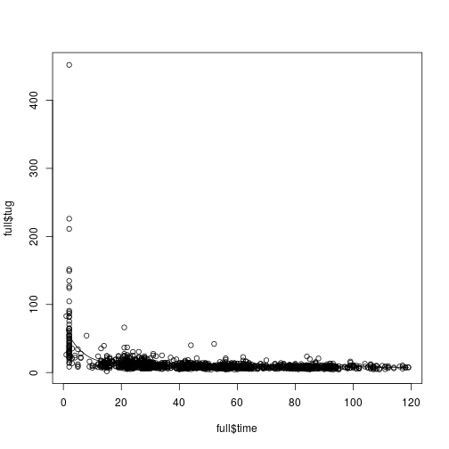
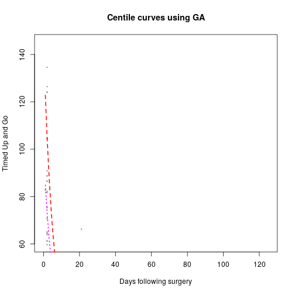
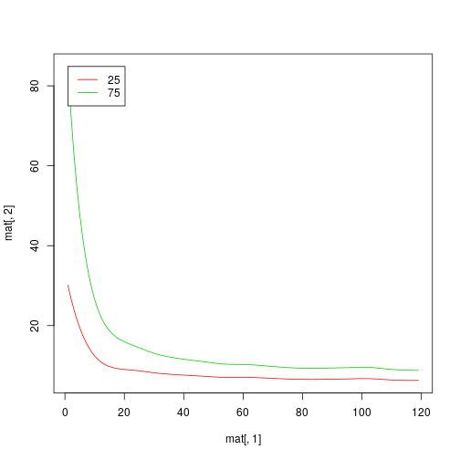

# Introduction

This is the markdown file that explains the steps for the time to up and go predictive analysis.

Steps are as follows:

1. Data Import and Check
2. Use Brokenstick model to predict 90 day timed-up-and-go (TUG) 
3. Predict 90 day TUG based om preoperative markers (i.e. age, gender, and etc) using predictive mean matching (i.e. linear model) in order to match patients that have closest prediction. These 90 day TUG is obtained only for the purposes of selecting patients for the GAMLSS regression for "close-to-me" matched regression.
4. GAMLSS regression based on $n$-matches selected. The $n$ will be selected based on cross validation. Additionally, the GAMLSS hyperparameters will be selected based on cross validation.

Next steps will be adjusted according to our wednesday meetings.

## Data Import and Check


We need a few libraries to be loaded. Specifically `gamlss` and `brokenstick` are the libraries that will be used for predicting the TUG and `dplyr` and `data.table` for data import.

### Import Data

```r
rm(list=ls())
library(gamlss)
library(brokenstick)
library(dplyr)
library(data.table)
library(readxl)
df <- read_excel("../data/TUG_070118.xlsx")
```


```r
head(df)
```

```
## # A tibble: 6 x 9
##   patient_id train_test dataset_id  time   bmi gender   age   tug b_tug
##        <dbl>      <dbl>      <dbl> <dbl> <dbl>  <dbl> <dbl> <dbl> <dbl>
## 1          1          1          1   -11  22.1      2    65  7.59  7.59
## 2          1          1          1    22  22.1      2    65 11.1   7.59
## 3          1          1          1    52  22.1      2    65  8.37  7.59
## 4          1          1          1   100  22.1      2    65  7.86  7.59
## 5          1          1          1   196  22.1      2    65  7.62  7.59
## 6          1          1          1   378  22.1      2    65  8.09  7.59
```

```r
summary(df)
```

```
##    patient_id      train_test      dataset_id         time        
##  Min.   :  1.0   Min.   :1.000   Min.   :1.000   Min.   :-339.00  
##  1st Qu.:128.0   1st Qu.:1.000   1st Qu.:3.000   1st Qu.:  15.00  
##  Median :264.5   Median :1.000   Median :3.000   Median :  45.00  
##  Mean   :275.3   Mean   :1.282   Mean   :3.357   Mean   :  83.48  
##  3rd Qu.:423.0   3rd Qu.:2.000   3rd Qu.:4.000   3rd Qu.:  90.00  
##  Max.   :605.0   Max.   :2.000   Max.   :6.000   Max.   :1182.00  
##       bmi            gender           age             tug        
##  Min.   :17.85   Min.   :1.000   Min.   :18.26   Min.   :  1.80  
##  1st Qu.:27.15   1st Qu.:1.000   1st Qu.:59.00   1st Qu.:  7.06  
##  Median :30.70   Median :2.000   Median :65.00   Median :  8.62  
##  Mean   :31.36   Mean   :1.542   Mean   :64.71   Mean   : 10.78  
##  3rd Qu.:35.10   3rd Qu.:2.000   3rd Qu.:70.00   3rd Qu.: 10.94  
##  Max.   :56.24   Max.   :2.000   Max.   :88.88   Max.   :452.00  
##      b_tug       
##  Min.   : 4.190  
##  1st Qu.: 7.303  
##  Median : 8.970  
##  Mean   :10.127  
##  3rd Qu.:11.342  
##  Max.   :59.100
```
### Clean Data

Here we want to remove rows where key measures are missing. note: it would be nice to automate this in the future where the user specifies the outcomes of interest and the timeframe


```r
# remove na TUG
df<-df[!is.na(df$tug) & !is.na(df$time),]
# make two datasts  keep only postop data
df_pre <- df[(df$time<0), ]
df_post <- df[(df$time>0), ]
df_pre %>% head; df_post %>% head
```

```
## # A tibble: 6 x 9
##   patient_id train_test dataset_id  time   bmi gender   age   tug b_tug
##        <dbl>      <dbl>      <dbl> <dbl> <dbl>  <dbl> <dbl> <dbl> <dbl>
## 1          1          1          1   -11  22.1      2    65  7.59  7.59
## 2          2          1          1    -4  31.4      1    64 10.3  10.3 
## 3          3          1          1   -17  24.5      1    64 10.1  10.1 
## 4          4          1          1    -7  19.5      2    50  7.69  7.69
## 5          5          1          1    -4  33.8      2    55 13.8  13.8 
## 6          6          1          1    -6  33.2      2    66 15.6  15.6
```

```
## # A tibble: 6 x 9
##   patient_id train_test dataset_id  time   bmi gender   age   tug b_tug
##        <dbl>      <dbl>      <dbl> <dbl> <dbl>  <dbl> <dbl> <dbl> <dbl>
## 1          1          1          1    22  22.1      2    65 11.1   7.59
## 2          1          1          1    52  22.1      2    65  8.37  7.59
## 3          1          1          1   100  22.1      2    65  7.86  7.59
## 4          1          1          1   196  22.1      2    65  7.62  7.59
## 5          1          1          1   378  22.1      2    65  8.09  7.59
## 6          1          1          1  1158  22.1      2    65  7.2   7.59
```

```r
#  limit data to first 4 months due to sparsity of long term outcomes
df_post <- df_post[(df_post$time<121), ]
# sort by patient ID and then by time
df_post <- df_post[order(df_post$patient_id, df_post$time),]
df_post<-df_post[,c("patient_id", "tug", "time")]
full <- df_post
head(df_post)
```

```
## # A tibble: 6 x 3
##   patient_id   tug  time
##        <dbl> <dbl> <dbl>
## 1          1 11.1     22
## 2          1  8.37    52
## 3          1  7.86   100
## 4          2 21.9     28
## 5          2 11.1     56
## 6          2  9.3     94
```

## Brokenstick model

Here we'll set up a few knots where we want to estimate the $y$ day post `tug` based on `time`

```r
knots <- c(0, 20, 55, 90)

fit <- brokenstick(y = df_post$tug,
                   x = df_post$time,
                   subjid = df_post$patient_id,
                   knots = knots)

est1<-predict(fit, at="knots")
head(est1)
```

```
##   subjid   x  y      yhat knot
## 1      1   0 NA 42.076188 TRUE
## 2      1  20 NA 11.374096 TRUE
## 3      1  55 NA  8.259509 TRUE
## 4      1  90 NA  7.670080 TRUE
## 5      1 119 NA  7.425744 TRUE
## 6      2   0 NA 65.288501 TRUE
```

```r
#extract fitted outcome Y90
df_all <- left_join(
                    left_join(
                              # 90 day covariates
                              est1[est1$x==90,] %>%
                                  rename(y90 = yhat,
                                         patient_id = subjid),
                              # early covariates
                              est1[est1$x==20,] %>%
                                  rename(y20 = yhat,
                                         patient_id = subjid),
                              by="patient_id"
                              )  %>% 
                    # select only the relevant variables 
                    select(patient_id, y90, y20)
                ,
                # preoperative data for baseline info like age bmi, kaf
                df_pre %>% 
                    mutate(patient_id = as.factor(patient_id))
                , by = "patient_id"
                ) %>%
# select those without missing variables and age above 20
filter(!is.na(tug), !is.na(y90), !is.na(age), age > 20) %>%
mutate(gender = as.factor(gender)) %>%
select(patient_id, age , bmi,gender, tug , time,
       y20, y90)
head(df_all) 
```

```
##   patient_id age      bmi gender   tug time       y20       y90
## 1          1  65 22.06783      2  7.59  -11 11.374096  7.670080
## 2          2  64 31.38579      1 10.29   -4 22.820061 10.641291
## 3          3  64 24.53487      1 10.14  -17 10.306360  7.796600
## 4          4  50 19.45359      2  7.69   -7  9.906743  6.542668
## 5          5  55 33.84454      2 13.79   -4 18.025244 10.058142
## 6          6  66 33.17806      2 15.64   -6 16.230163  9.913498
```

## Predictive Mean Matching and GAMLSS


```r
pmm<-lm(y90~tug + age , data=df_all)
summary(pmm)
```

```
## 
## Call:
## lm(formula = y90 ~ tug + age, data = df_all)
## 
## Residuals:
##     Min      1Q  Median      3Q     Max 
## -4.9897 -0.7349 -0.1741  0.4961 10.0722 
## 
## Coefficients:
##             Estimate Std. Error t value Pr(>|t|)    
## (Intercept) 5.171452   0.430012  12.026   <2e-16 ***
## tug         0.151110   0.011260  13.420   <2e-16 ***
## age         0.018995   0.006661   2.852   0.0045 ** 
## ---
## Signif. codes:  0 '***' 0.001 '**' 0.01 '*' 0.05 '.' 0.1 ' ' 1
## 
## Residual standard error: 1.348 on 593 degrees of freedom
## Multiple R-squared:  0.2598,	Adjusted R-squared:  0.2573 
## F-statistic: 104.1 on 2 and 593 DF,  p-value: < 2.2e-16
```
Although the `R-sq` isn't perfect, this `pmm` model is used only to get at selecting patients with similar predicted outcomes. Now add them to our `df_all`:

Now given that we're just going to keep it simple with the predictive mean meatching with a LM, we proceed as such but maybe we can revisit the matching based on gamlss.


```r
# extract fitted values for the linear model (PREOP only here)
df_all <- df_all %>%
        select(patient_id, y20, y90, tug, age) %>%
            cbind(pmm$fitted.values) %>%
                rename(id = patient_id, y20rom = y20,  
                                  Fitted = `pmm$fitted.values`) %>%
    #dataset ordered by fitted values
    arrange(Fitted)
```

Let's check the reference model. We'll try using various distributions with GAIC as our model selection tool.

```r
ref1<-gamlss(tug~cs(time^0.5, df=2),
                             sigma.formula = ~cs(time^0.5, df=1),
                                              data=full, family=NO)
ref2<-gamlss(tug~pb(time),
                             sigma.formula = ~pb(time),
                                              data=full, family=NO)
ref3<-gamlss(tug~pb(time),
                             sigma.formula = ~pb(time),
                                              data=full, family=GA)
ref4<-gamlss(tug~pb(time),
                             sigma.formula = ~pb(time), 
                             # no nu
                                              data=full, family=BCCG)
ref5<-gamlss(tug~pb(time),
                             sigma.formula = ~pb(time),
                             # yes nu
                             nu.formula = ~pb(time),
                                              data=full, family=BCCG)
```

```r
GAIC(ref1, ref2, ref3, ref4, ref5, k = log(length(full$patient_id)))
```

```
##             df       AIC
## ref3 16.649241  9052.749
## ref2 12.779033  9710.889
## ref1  6.999181  9729.889
## ref4 27.506972 12738.069
## ref5 30.041846 12754.357
```
It seems that based on the fitting of both shape and scale smoothing functions, the `GA` distribution seems to fit the data the best. quick plot:


```r
plot(full$tug~full$time)
lines(fitted(ref3)[order(full$time)]~full$time[order(full$time)])
```



GIven that the data will probably be updating continuously, this process will also have to be configured to get the optimal fitting model.


```r
par(mfrow=c(1,1))
centiles(ref3, xvar=full$time, cent=c(10,25,50,75,90), 
         ylab= "Timed Up and Go", xlab="Days following surgery", 
         xleg=150, yleg=90, col.centiles = c(2,6,1,6,2), xlim=range(0,125),
         ylim=range(60,145),
         lty.centiles = c(2,3,1,3,2),
         lwd.centiles =c(2,2,2.5,2,2), points=T)
```



```
## % of cases below  10 centile is  6.097561 
## % of cases below  25 centile is  24.62253 
## % of cases below  50 centile is  54.99419 
## % of cases below  75 centile is  79.90708 
## % of cases below  90 centile is  91.11498
```

Here are the centiles for $10\%, 25\%, 50\%, 75\%, and 90\%$. Below is the IQR's.


```r
mint<-min(full$time)
maxt<-max(full$time)
iqrfull<-centiles.pred(ref3, type="centiles",  xname = "time", xvalues=c(mint:maxt),
                   cent=c(25,75), plot=TRUE)
```

```
## new prediction 
## New way of prediction in pb()  (starting from GAMLSS version 5.0-3) 
## new prediction 
## New way of prediction in pb()  (starting from GAMLSS version 5.0-3)
```



```r
iqrfull$iqr<-iqrfull$C75-iqrfull$C25
mean(iqrfull$iqr)
```

```
## [1] 6.074683
```


## Cross Validation
